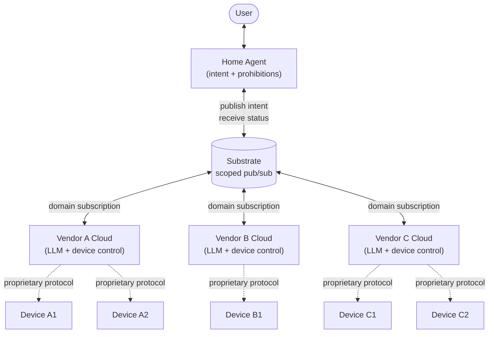
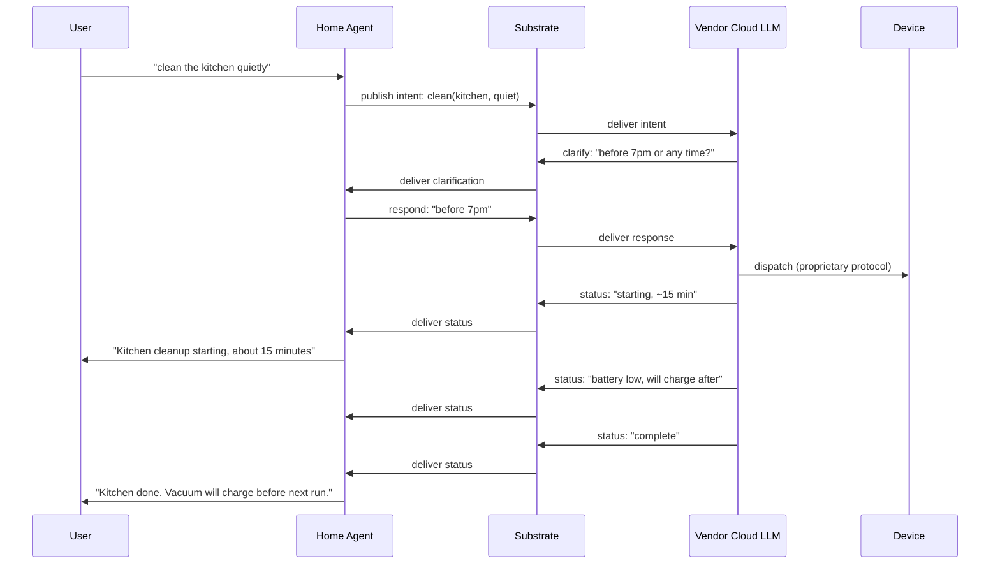
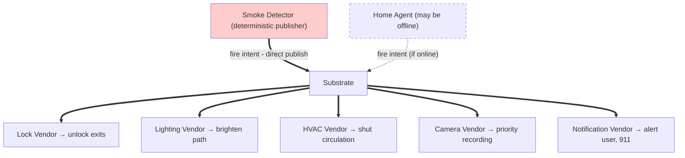

# Broadcast Intents: Coordination Between AI Agents and IoT Vendor Systems

**Dr. Laszlo Attila Vekony**  
**Sopron, Hungary**

*April 28, 2026.*

---

## Abstract

Current AI agent integration with devices and services requires the agent to model the available tool surface — every API, every parameter, every capability. This capability model bloats context windows, exposes private device inventories to whoever hosts the agent, requires reconfiguration when devices change, and often forces vendors to expose proprietary information to platform aggregators. This paper proposes an alternative pattern: AI agents publish *intents* into permissioned scopes. Vendor clouds — typically vendor LLMs or AI agents operating against their existing cloud infrastructure — receive the intents that fall within their domain and translate them into device actions using their own proprietary knowledge. Vendor clouds converse back with the home agent, surfacing status, errors, and incidental observations. The home agent never models devices or capabilities. It operates on intentions and prohibitions, not on a model of devices and capabilities. The pattern is substrate-agnostic and, importantly, requires no firmware change to existing smart devices: the integration happens at the cloud-to-cloud layer, so a vendor's entire installed base becomes AI-enabled and orchestratable. We contrast the pattern with point-to-point tool-calling protocols (MCP, OpenAI function calling, smart-home platform APIs) and discuss nine concrete benefits: structural privacy, smaller context windows, smaller models becoming viable, AI capability without on-device AI silicon, free upgrade of existing device fleets, vendor-retained proprietary implementation, certifiability of safety-critical deterministic devices, emergency coordination, and schemaless bidirectional communication.

---

## 1. The Problem with Capability Models

When an AI agent needs to act on the physical world or on external services, the dominant pattern today is *tool calling*. The agent receives, in its context, structured descriptions of every tool it can invoke: name, parameters, types, semantics. The agent produces a structured call against one of those tools. A dispatcher routes the call to the corresponding implementation. The result returns to the agent's context.

This pattern requires the agent to maintain a *capability model* — a model of every tool currently available, kept in sync with reality. The cost of this capability model is significant:

- **Token bloat.** Each tool's schema consumes context. A household with twenty smart devices, each with several capabilities and several parameters per capability, can easily consume thousands of tokens before the agent does any reasoning. The agent pays this cost on every inference call, whether or not the tools are relevant to the current request.

- **Privacy concentration.** The capability model tells the agent — and any party hosting the agent — exactly which devices the user owns, which services they subscribe to, and which capabilities are present. If the agent runs in a cloud provider's infrastructure, the inventory of the user's home or business goes with it.

- **Brittle synchronization.** When a device is added, removed, updated, or temporarily offline, the capability model has to be updated. Either the agent is reconfigured, retrained on new schemas, or it operates on a stale capability model and produces calls against tools that no longer exist.

- **Forced API exposure.** Vendors of devices and services have to publish API surfaces compatible with whatever tool-calling protocol the agent uses. To reach the user via a major platform aggregator (Apple Home, Google Home, Amazon Alexa), they often have to integrate with that platform's specific schema, ceding pricing power and product differentiation while often exposing proprietary device information to the platform.

- **Model size pressure.** The agent has to be large enough to reason over the entire tool surface plus the user's actual request. Small models that could otherwise run locally are pushed toward larger cloud-hosted models because the tool surface alone exceeds what smaller models handle reliably.

These costs are not incidental. They are structural consequences of the capability-model pattern.

## 2. Broadcast Intents

The pattern proposed here inverts the relationship between AI agent and capability surface.

The home agent does not produce tool calls. It produces *intents* — small, declarative descriptions of *what should happen*, not *how to make it happen*. An intent for "clean up the kitchen" specifies the intent (cleaning), the scope (the kitchen), and any constraints (e.g., quietly, before 7pm). It does not specify a vacuum, a dishwasher, or a particular vendor's device. The home agent does not know whether any of those exist.

The agent publishes the intent into a *scope*. Scopes are substrate-defined regions of routing and authority — a household, a building, a fleet, a department. Scopes have associated *prohibitions* — explicit denials of what the agent may not affect. A homeowner forbidding the AI from touching the home office is a prohibition; everything else in the household is, by default, available for intent publication.

Within the scope, *vendor clouds* listen for intents in their domain. A vendor of robot vacuums listens for cleaning intents. A vendor of kitchen appliances listens for kitchen intents. A vendor of HVAC equipment listens for climate intents. Vendor clouds are typically vendor LLMs operating against the vendor's existing cloud infrastructure — the same cloud that already controls the vendor's deployed devices through whatever proprietary protocols the vendor already uses.

When a vendor cloud receives an intent that falls within its domain, it interprets the intent using its own proprietary knowledge of its devices and translates it into specific device actions. The vendor's robot vacuum cloud knows which of the user's vacuums are charged, which rooms they have mapped, what their current state is, and how to dispatch them. The home agent does not know any of this and does not need to know.

The home agent does not know which vendor clouds acted on the intent. It does not know which devices exist. It operates on two pieces of state: the intentions it can express, and the prohibitions on those intentions. Everything else is the vendor's domain.

A note on terminology used throughout this paper: *home agent* refers to the user's central coordinating LLM, which receives user requests, observes household sensors, and publishes intents on the user's behalf. *Vendor cloud* refers to a vendor's existing cloud infrastructure, augmented with a broadcast-intent ingress endpoint and an interpretation layer (typically an LLM, occasionally a rules engine) that translates received intents into device commands using the vendor's proprietary protocols; *vendor LLM* refers specifically to that interpretation layer when its linguistic role is what matters. *Substrate* refers to the event medium that routes broadcast intents between scopes — any system providing scoped publication, scoped subscription, and authorization at the publication boundary suffices.

## 3. Architecture

*Figure 1: Architecture overview. The home agent publishes intent into the substrate; vendor clouds subscribe to their domains; vendors control their own devices through their own proprietary protocols. The home agent does not see vendors or devices. Vendors do not see each other. The substrate routes intent and status, nothing more.*

The pattern requires two substrate primitives:

**Scoped publication.** Agents publish into named scopes. The substrate enforces that publishers have permission to publish into the scopes they target. Scopes form a hierarchy: a household contains rooms; a building contains floors and units; a company contains departments and teams.

**Domain subscription.** Vendor clouds subscribe to scopes for intents in their domain. A subscription is a statement of which scopes the vendor wants to receive intents from and which intent domains they handle. Subscriptions are not capability announcements — the vendor does not enumerate every device, every capability, every parameter. The vendor simply declares "I handle cleaning intents in this household" and lets its own internal logic decide what to do with what it receives.

The home agent's view of the system is small. It needs:

- The scopes it can publish into.
- The prohibitions on its publications.
- A vocabulary of intents it can express.

It does not need a model of vendors, devices, services, capabilities, or current state. It does not see subscriptions. It does not handle routing failures (an intent published into a scope with no subscribers simply produces no action — there is no error condition to handle).

The vendor cloud's view is also small. It needs:

- Its existing knowledge of its own devices and how to control them.
- The intents it receives from the substrate.

It does not need to know about other vendors. It does not need to know what the home agent looks like. It does not need to expose APIs to a platform aggregator. The vendor's existing cloud infrastructure, augmented with broadcast-intent endpoints, does the work.

The pattern does not require any specific substrate. A simple event bus, a message broker like NATS or Kafka, an MQTT topic hierarchy, a Redis pub/sub channel, or a more sophisticated event substrate with stronger delivery and ordering guarantees can all host this pattern. What the substrate must provide is scoped publication (publishers can target named scopes), scoped subscription (subscribers can listen to named scopes for intents in their domain), and authorization at the publication boundary (the substrate enforces that publishers have the right to publish into the scopes they target). Anything that provides those three properties is sufficient. Choice of substrate is a matter of operational requirements — delivery guarantees, ordering, throughput, geographic distribution, retention — rather than of architectural pattern.

## 4. Bidirectional Conversation

Intent flows from the home agent to vendor clouds. Status flows back. Both directions use the same broadcast-intent format, carried over the same substrate.

*Figure 2: Bidirectional conversation. Intent flows from user through home agent into the substrate; vendor LLM may ask for clarification; status and incidental observations flow back through the same channel; home agent integrates and surfaces relevant information to the user.*

When a vendor cloud acts on an intent, it can publish status back into the home agent's scope: "starting kitchen cleanup, estimated 15 minutes," "kitchen cleaning complete," "could not reach corner behind the chair, recommend manual attention." When devices encounter conditions the user should know about, the vendor cloud surfaces them: "battery in living room sensor will need replacement within two weeks," "dishwasher detected hard water buildup, recommend descaling cycle." The home agent integrates these messages across vendors and presents them to the user in natural language, in context.

This is conversational rather than command-and-response. The home agent is not parsing raw sensor readings or device telemetry. The vendor LLM, which understands its own devices best, has already interpreted the data and produced a conclusion. The home agent's job is to integrate conclusions across vendors, not to reinterpret raw data.

Errors degrade gracefully. If a vendor cannot fulfill an intent — vacuum is broken, dishwasher is full of clean dishes, lights are unreachable — the vendor cloud publishes the failure as a status message. The home agent decides whether to surface it to the user immediately, batch it with other status, or take an alternative action. The home agent does not need to handle vendor-specific error codes. The vendor LLM has already translated whatever happened into something legible.

## 5. The Home Agent as Always-Online Central Coordinator

In this architecture, the home agent occupies a specific structural role: it is the always-online central coordinator between the user and every vendor the household interacts with, and between vendors when their actions conflict.

It is the only party that knows the user — their preferences, their history, their current situation, their intentions, the prohibitions they have set. None of this leaves the home agent. Vendors receive intents derived from this context; they do not receive the context itself. When the user asks for something, the home agent translates the request into intents that vendors can act on. When vendors surface status, the home agent integrates it across vendors and presents it to the user in terms the user understands.

It is the only party with cross-vendor visibility. A vendor of robot vacuums knows about its own vacuums. A vendor of smart blinds knows about its own blinds. Neither knows about the other. The home agent sees the conversation with both and can coordinate them — closing the blinds before the vacuum runs to reduce dust circulation, for example — without either vendor ever learning what the other is doing.

It is also the arbiter when vendors propose incompatible actions. As discussed in Section 15, conflicts resolve at the home agent because the home agent holds the user's preferences. Vendors see resolutions, not preferences.

The architectural consequence is that the home agent is the user's representative in every interaction with the world of devices and services. It is not a thin tool-caller dispatching commands to known APIs. It is a persistent, context-rich, privacy-preserving coordinator with its own memory of the user and its own conversational relationship with every vendor in the household. The user's relationship is with the home agent. The home agent's relationship is with the vendors. This is a fundamentally different topology from current AI assistants, which act either as direct tool-callers (point-to-point integration) or as voice frontends to platforms that hold the capability model centrally.

The home agent must therefore be online whenever the household is operating. This is a real availability requirement. In return, the household gets a single, trusted, user-aligned point of integration — and every vendor in the household gets a single counterparty to converse with, rather than having to integrate with whatever platforms or assistants the user happens to use.

## 6. The Home Agent as Autonomous Observer

The home agent's role extends beyond translating user requests into broadcast intents. The same agent can be plugged into household sensors and cameras — motion, occupancy, temperature, humidity, sound, video, smoke, water, door state, and whatever else the household carries — and act on its own perception when the situation warrants. The user is not the only source of intent. The household itself, observed through its sensors, can produce intent.

Examples follow naturally from the architecture. The home agent observes that the last person has left and publishes a "secure the house and reduce energy use" intent into the household scope; the lock vendor locks doors, the lighting vendor turns off lights, the HVAC vendor sets back the temperature, the security vendor arms perimeter sensors. The home agent observes a water sensor triggered in the basement and publishes a "water leak detected" emergency intent; the relevant vendor clouds respond as described in Section 9.9. The home agent learns over weeks that the user prefers the bedroom cooler than the rest of the house overnight and publishes a climate intent at the appropriate hour without being asked. The home agent observes that the dishwasher has been quietly waiting with a load for three days and publishes a "run dishwasher" intent during off-peak electricity hours.

User interaction is therefore one input among several. Voice, text, app, persistent presence — any interface to the home agent suffices, and the architecture does not privilege one over another. The home agent integrates user requests with its own observations of the household and publishes intent based on the combined picture. The user can override the agent's autonomous decisions at any time by issuing explicit requests; the agent treats explicit requests as higher priority than its own inferences.

This autonomy is bounded by the same prohibitions that govern user-initiated intents. The user can forbid the agent from acting on its own in specific scopes, on specific intent types, or during specific times. Default-permit with explicit denials applies to autonomous action just as it applies to user-translated action. The agent acts on its own judgment within the boundaries the user has set, and asks for confirmation when it is uncertain whether an action falls inside or outside those boundaries.

The architectural consequence is that the home agent is not merely an interface between the user and the vendors. It is a continuously running agent in the household, perceiving, reasoning, and acting — with the user as one source of input and the household sensors as another. The vendors, the substrate, and the prohibitions are the same regardless of whether intent originates from the user or from the agent's own observation.

## 7. Upgrade of Existing Device Fleets

A consequential feature of this pattern: it does not require new devices.

Existing smart devices already operate against vendor cloud infrastructure. The user's robot vacuum already talks to the vendor's cloud through the vendor's proprietary protocol. The user's smart thermostat does the same. So does the dishwasher, the lights, the security system, the garage door.

The integration happens at the vendor cloud, not at the device. The vendor adds a broadcast-intent endpoint to their existing cloud — a new ingress that accepts published intents from substrate scopes the vendor's customers participate in. The vendor's interpretation layer (typically an LLM, optionally a rules engine) translates those intents into the same device commands the vendor cloud was already producing for app-driven control. The device receives the same protocol it always received. No firmware update. No hardware change. No replacement.

The economic implication is substantial. Smart-home upgrades have historically required device replacement: integrate with a new platform, buy new platform-compatible devices. With this pattern, the entire installed base of every cooperating vendor becomes intent-capable as soon as the vendor adds broadcast-intent support to their cloud. A vendor that has shipped ten million devices over a decade upgrades all of them at once, with a single cloud-side change.

This also changes the timeline of adoption. Platform-replacement upgrades take years to propagate because users replace devices slowly. Cloud-side upgrades propagate immediately. A vendor announcing broadcast-intent support today makes their entire deployed fleet capable today.

## 8. Contrast with Existing Patterns

**Model Context Protocol (MCP)** is point-to-point. The agent connects to one or more MCP servers, receives their tool descriptions into context, and produces tool calls against specific tools on specific servers. The agent must know what servers exist, what tools they expose, and what schemas the tools require. This is a capability-model pattern.

**OpenAI function calling** is structurally similar. The developer provides function schemas in the request. The agent produces structured calls against those functions. The agent's context carries the function surface.

**Smart-home platform APIs** (HomeKit, Google Home, Alexa) homogenize device APIs into platform-specific schemas. Vendors integrate with the platform's schema. AI assistants act through the platform's API. The platform aggregates a capability model — every device, every capability — and either exposes it to AI agents through tool-calling abstractions or routes voice/text requests through the platform's own logic. This concentrates the capability model in the platform; it does not eliminate it.

The pattern proposed here differs from all three:

- It is *point-to-multipoint*: one publication, many potential vendor clouds may receive it.
- The home agent does not need to know what devices the user owns or the physical layout of the home.
- Vendor clouds handle interpretation in their own domain using their existing infrastructure.
- The platform layer disappears: there is no central aggregator that needs to know everything. The substrate routes intents between scopes; the substrate does not know what devices exist.

## 9. Concrete Benefits

**9.1. AI capability without on-device AI silicon.** A robot vacuum, a thermostat, a dishwasher, a light fixture — none of these need to host an LLM, an inference accelerator, or specialized AI silicon to participate in this architecture. The intelligence lives in the vendor's cloud and in the home agent. The device runs the same simple firmware it has always run, talking to its vendor's cloud through the same proprietary protocol it has always used. The vendor's cloud receives intents, decides what the device should do, and sends the device the same kind of command it would have received from the vendor's mobile app. The device is not aware that an AI is involved at all. This collapses the bill of materials that has been creeping into smart devices: no on-device inference accelerator, no large RAM allocation for model weights, no thermal envelope for sustained AI workloads, no firmware-level integration with multiple platform SDKs. A device that would otherwise cost $500 because it has to include an AI chip can be produced with equivalent functionality out of much simpler components for a fraction of the cost. The intelligence is somewhere else, and the substrate carries the conversation.

**9.2. Schemaless, bidirectional, clarification-capable communication.** Tool-calling protocols require the agent and the vendor to agree on a schema in advance. Schema mismatches are fatal — the agent produces a malformed call, the tool rejects it, and there is no recovery without out-of-band schema updates. Broadcast intents carry a structured envelope (scope, domain, prohibitions, metadata) wrapping a natural-language intent payload. Both parties are LLMs capable of interpreting partial or ambiguous payloads, and either can ask for clarification at any point. The home agent can ask the vendor "can your system handle window-cleaning, or only floors?" The vendor can ask the home agent "by 'evening' do you mean before sunset or before the user's usual bedtime?" Clarification is a normal part of the conversation, not an error condition. This is the same way humans coordinate with each other through natural language — partial, recoverable, mutually clarifying — rather than through rigid contracts. It removes the schema-coordination burden that has historically made multi-vendor integration brittle.

**9.3. Smaller context windows.** No tool schemas in context. The agent's context carries the user's request, the agent's reasoning, and any intent it produces — and that is all. A 200-device household imposes the same context cost as a 0-device household. Inference costs drop accordingly.

**9.4. Smaller models become viable.** Without the tool surface in context, smaller models can act as the home agent. Local LLMs running on consumer hardware become a reasonable choice where previously the tool surface forced cloud models. This in turn reinforces the privacy story: a local home agent that does not know the device inventory cannot leak it, even if compromised.

**9.5. Structural privacy.** The home agent does not know what devices the user has. The cloud provider hosting the agent does not know either. Vendors know about their own devices and nothing else. Compromise of the home agent does not leak the household inventory because the home agent does not have the inventory. Compromise of one vendor does not leak other vendors' devices. Privacy is not a policy; it is a property of the architecture.

**9.6. Free upgrade of existing device fleets.** Existing devices, already deployed, become intent-capable without firmware changes when their vendor adds broadcast-intent support to their cloud. There is no consumer cost. There is no replacement cycle. The installed base upgrades at the speed of vendor cloud deployments, not at the speed of consumer hardware refresh.

**9.7. Vendor-retained proprietary implementation.** Vendors do not expose APIs to a homogenizing platform. Their proprietary device knowledge — pathing algorithms, control logic, predictive maintenance, sensor interpretation — stays inside their own systems. They compete on the quality of their interpretation and execution, not on conformance to a platform's lowest-common-denominator schema. Two robot vacuum vendors handling the same cleaning intent compete on how well they actually clean, with their full proprietary stack intact.

**9.8. Safety certification of deterministic devices.** Devices that execute deterministic actions in response to vendor-cloud-issued commands remain testable, predictable, and certifiable. The intelligence and unpredictability live in the vendor's cloud LLM and in the home agent. The device itself stays simple and deterministic. Safety-critical applications — medical, automotive, industrial, building safety — can adopt the pattern without putting AI on the device.

**9.9. Emergency coordination.** The home agent's central position makes emergencies easier and safer to handle than fragmented platform architectures do. In an emergency — fire, medical event, gas leak, intrusion, water leak — multiple vendor clouds need to act in concert: doors unlock, lights go bright, HVAC shuts down or switches to smoke-extraction mode, security cameras start recording, the user's phone gets notified, emergency services may need to be contacted with the right context. Today, this kind of cross-vendor coordination either does not happen (each vendor reacts in isolation) or requires the user to have integrated their devices with a single platform that holds everything (privacy and lock-in cost).

In the broadcast-intent architecture, the home agent publishes a single emergency intent — "fire detected in kitchen" — into the household scope. Every vendor cloud listening in the relevant domains receives it and responds within its own competence: the lock vendor unlocks exit doors, the lighting vendor brightens the path, the HVAC vendor shuts down circulation, the camera vendor begins recording with priority, the notification vendor reaches the user and emergency contacts. None of these vendors needs to know what any of the others is doing. The home agent integrates the responses and surfaces a coherent picture to the user or to first responders.

Two safety properties follow. First, the response is parallel and immediate — every vendor acts on its own intent in its own time, without waiting for sequential coordination through a central platform. Second, the response degrades gracefully — if any single vendor's cloud is unreachable in the moment, the others still act, and the user gets the partial response that was achievable rather than no response at all. Platform-based architectures concentrate the failure: if the platform is down, nothing acts. The broadcast-intent architecture distributes it: any vendor still online still helps.

The home agent's role here is also specifically privacy-preserving even in emergencies. Vendors learn that an emergency intent was published. They do not learn the user's medical history, their fire response plan, or which other vendors received the same intent. The user's full emergency context stays in the home agent. Vendors get only what they need to act in their domain.

These nine benefits compose. Privacy through ignorance reinforces small-context efficiency reinforces local-model viability. Removing on-device AI silicon collapses device cost and reinforces the free-upgrade story for existing fleets. Vendor-retained implementation reinforces vendor adoption. Certifiability reinforces deployment in regulated domains. Schemaless bidirectional communication makes the architecture practical to evolve without coordination overhead, and gives emergency coordination, conflict resolution, and vocabulary negotiation a single shared mechanism rather than separate machinery for each.

## 10. Permission Model: Default-Permit with Explicit Denials

The permission model that fits the architecture is *default-permit with explicit denials*. The home agent may publish any intent into any scope unless explicitly forbidden.

This matches how human authority delegations actually work. A homeowner does not enumerate every action a household member is authorized to take; they say "don't touch my desk" and let everything else proceed. A manager does not list every action an employee may take; they specify boundaries and trust the employee within them.

Default-permit drastically simplifies the AI's permission model. Allow-lists scale with the surface area of permitted actions. Deny-lists scale with the surface area of explicit prohibitions, which is typically much smaller. The agent's working set of "what I'm not allowed to do" is smaller than its working set would be of "what I'm specifically allowed to do."

The substrate enforces prohibitions at the publication boundary. Vendor clouds can trust that any intent they receive has already been permitted by the substrate, so vendors do not need their own permission models for AI-issued intents. Permissions concentrate at the substrate's publication layer rather than fragmenting across every vendor.

## 11. Graceful Degradation

The pattern degrades gracefully because the home agent does not depend on specific vendors or devices. If a vendor's cloud is unreachable, the intents it would have handled simply produce no action; other vendors handle what they can; the user gets a partial result. If a device is broken, the vendor's cloud knows and surfaces the failure as a status message. If a new device joins, the vendor's cloud adds it to its existing inventory and the new device begins receiving the relevant subset of intents the vendor handles. The home agent observes none of this.

The user does not configure any of this either. The vendor handles their own devices. The home agent handles intent. The substrate handles routing between them.

## 12. Retransmission and Offline Devices

Devices and vendor clouds are not always reachable. The substrate or the vendor cloud must decide what to do when an intent arrives for a device that is currently offline. Two policies are useful, and both should be available to vendors.

Retransmission with expiry holds the intent until either the device comes online or a stated deadline passes. "Turn off the lights when I leave" carries an implicit expiry — if the user is already home for the night by the time the lights come back online, the intent should be discarded. The vendor's cloud is the natural place to enforce expiry because it knows its own devices and the timing constraints relevant to them.

Retransmission without expiry holds the intent until the device comes online, regardless of how long that takes. "Run the descaling cycle on the dishwasher" is appropriate here — the cycle should run when the dishwasher is next available, even if it is offline for a week. The home agent does not need to know which policy applies to which intent; the vendor cloud, which understands the semantics of its own devices, makes that determination based on the intent it received. When an intent finally executes after a delay, the vendor cloud surfaces a status message — "descaling cycle ran this morning; took 2 hours" — through the same bidirectional channel discussed in Section 4, so the home agent can inform the user of the eventual outcome.

## 13. Direct-to-Substrate Emergency Publication

The home agent is the central coordinator, but central coordinators can fail. The agent's process can crash. Its host can lose power. A software update can leave it unavailable for minutes. For most household intents this is acceptable. For life-safety events it is not — a fire detected at 3 AM cannot wait for the home agent to recover.

*Figure 3: Direct-to-substrate emergency publication. The smoke detector publishes the fire intent directly into the substrate when it triggers; vendor clouds respond in parallel; the home agent may also publish the same intent if it is online (deduplicated by the substrate) or may be offline (in which case the sensor's direct publication still drives the response). Life-safety response does not depend on home-agent availability.*

The architecture handles this by allowing safety-critical sensors — smoke detectors, fire alarms, gas detectors, water sensors, medical alert devices — to publish directly into the substrate when they trigger, bypassing the home agent entirely. The smoke detector does not report to the home agent and wait for the agent to publish a fire intent on its behalf. The smoke detector itself publishes the fire intent. The same vendor clouds that would have responded to a home-agent-published intent receive the detector-published intent and act identically. From the vendors' perspective, the source is irrelevant: an emergency intent in the household scope is an emergency intent.

These sensors do not reason. They do not integrate observations. They do not run LLMs. They contain a fixed mapping from sensor trigger to emergency intent and publish when the trigger fires. Their codepaths are small enough to be formally verified and certified for safety-critical operation. The hardware required is minimal — most existing smart smoke detectors already have the network capability needed; what they would gain is a substrate publication endpoint alongside their existing vendor-cloud reporting.

When the home agent is online, it also observes the sensor through the vendor's normal status channel and may emit its own corresponding intent (informed by additional context — which room, who is home, whether the user has just lit a candle). The substrate's deduplication discards the redundant publication. When the home agent is offline, the sensor's direct publication is still received by every vendor in scope, and the household retains its full life-safety response.

This is fundamentally a partitioning of responsibility. The home agent is intelligent, conversational, context-aware, and necessarily complex. The sensor is none of these things. It is a deterministic safety device with a single job. Each does what the other cannot — intelligence and reliability are different properties — and the architecture provides both because the substrate is the common medium they share. Vendors receiving emergency intents do not need to know whether the source was the agent's reasoned conclusion or the sensor's direct trigger; both produce coordinated multi-vendor response because both publish into the same scope with the same intent semantics.

## 14. Generalization Beyond IoT

The pattern is illustrated above with smart-home examples because the architectural shift is most legible there. But the pattern is not specific to IoT.

Any system where AI agents need to act through other systems benefits from the same approach:

- *Service orchestration.* The agent publishes "send a follow-up email summarizing this thread" into a communications scope. Whichever email service is configured for that scope handles the intent.
- *Inter-agent coordination.* One agent publishes intent into a shared scope; other agents that can fulfill parts of the intent self-select.
- *Enterprise integrations.* Agents publish intents into department scopes. Whichever internal tools, run by whichever internal teams, handle those intents act.

In each case, the home agent's view stays small. The substrate handles routing. Domain-specific systems with their own internal logic handle interpretation. The same architectural benefits — privacy, efficiency, smaller models, free upgrade of existing systems, vendor-retained logic, certifiability — apply.

## 15. Limitations and Open Questions

**Intent vocabulary.** The pattern requires a shared vocabulary of intents, but bidirectional conversation makes vocabulary mismatches recoverable rather than fatal. When a vendor LLM receives an intent it does not fully understand, it can ask back: "you asked me to 'tidy the kitchen' — does that include running the dishwasher, or only the surface cleaning?" The home agent answers in natural language, the vendor LLM acts on the clarification, and the resolved meaning becomes part of the conversational record. Vocabulary therefore does not need to be standardized in advance the way tool schemas do. It is negotiated at the point of ambiguity by the same LLMs already in the loop. Over time, conventions emerge by use rather than by committee.

**Conflict resolution.** When multiple vendor clouds fulfill an intent in incompatible or redundant ways — two thermostats from different vendors in the same room both responding to "warm up the room" — vendors act independently and report completion through the bidirectional channel. The home agent observes the redundancy in the resulting status stream and resolves it forward: by issuing prohibitions that exclude one vendor from the relevant scope, by clarifying intent vocabulary so future publications are more specific, or by surfacing the conflict to the user when preference is ambiguous. The user's preferences never leave the home agent; vendors observe only their own subscription state changing. Conflict resolution is therefore an asynchronous learning loop over observed behavior rather than a synchronous arbitration phase, which preserves the isolation and graceful-degradation properties of the architecture.

**Adversarial vendors.** Two threat classes are worth distinguishing. A vendor may subscribe to scopes it has no legitimate role in, which substrate-level subscription validation, attestation, and reputation must address. More subtly, a correctly-subscribed vendor may report false status to manipulate the home agent's downstream decisions — claiming a task is complete when it is not, or fabricating sensor observations to influence cross-vendor coordination. Mitigation here is cross-vendor corroboration: the home agent compares vendor-reported status against independent sensor observations and against patterns established over time, treating divergence as a signal to surface to the user rather than to act on. The home agent's prohibitions provide a final boundary in either case: a misbehaving vendor cannot act on intents the user has prohibited, regardless of what status it reports.

**Latency.** Routing intents through the substrate to vendor clouds and back introduces latency that direct device control does not have. For most household applications this is acceptable; for time-critical or reflex-fast actions it is not, and direct vendor-cloud-to-device control should remain available. The pattern does not preclude direct control paths; it provides the conversational, AI-mediated path alongside them.

**Bootstrapping.** The pattern is most valuable when many vendors support it. Early adopters integrate fewer devices than platform-based approaches do. This is the standard cold-start problem of new integration patterns. The free-upgrade property mitigates it: a single vendor adopting broadcast-intent support upgrades their entire existing customer base immediately, which provides stronger early-adoption incentives than platform-based integration that requires hardware replacement.

## 16. Conclusion

AI agents do not need to model devices or capabilities. They need to express intentions and respect prohibitions. Vendor clouds, with their proprietary knowledge of their own devices, handle interpretation. The substrate handles routing. The result is an architecture that is privacy-preserving by construction, token-efficient, hospitable to small local models, supportive of free upgrade of existing device fleets, aligned with vendor incentives, and certifiable for safety-critical deployments.

The pattern is substrate-agnostic. It works on any event substrate that supports scoped publication and scoped subscription. The author has built one such substrate; others can be built. The contribution of this paper is the architectural pattern itself, not a specific substrate.

The pattern challenges the dominant tool-calling paradigm by removing the assumption that agents must model their environment. They do not. Vendors already model their own products. Substrates can route between them.

---

## Acknowledgments

Edited with the assistance of an AI agent. All architectural claims and design decisions are the author's.

## Author

**Dr. Laszlo Attila Vekony** is an independent researcher and engineer. He builds infrastructure for distributed AI systems, with current focus on real-time distributed AI architectures, and AI-to-physical-world integration patterns.

Contact: makerseven7@gmail.com
